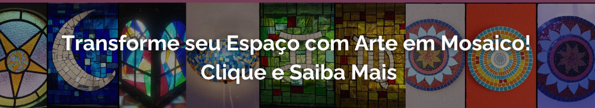

# Canto Arte Mosaico

**Canto Arte Mosaico** é um site institucional desenvolvido para promover o trabalho do artesão Fernando Paraboli, especializado em mosaicos. O site é totalmente responsivo, oferecendo uma navegação intuitiva tanto em desktops quanto em dispositivos móveis. O projeto utiliza tecnologias modernas como Bootstrap 3, jQuery, Owl Carousel e AOS para uma experiência visual dinâmica e envolvente.

## Sobre Fernando Paraboli

Fernando Paraboli é um artesão apaixonado que encontrou no mosaico uma maneira única de expressar sua criatividade e sensibilidade artística. Com mais de uma década de experiência, ele se especializou em transformar pequenos pedaços de vidro em verdadeiras obras de arte, criando mandalas, vitrais, espelhos, vasos e muito mais. Seu trabalho é uma celebração de cores e formas, unindo técnica e inspiração em cada peça que produz.

## Funcionalidades

- **Layout Responsivo:** O site adapta-se perfeitamente a diferentes tamanhos de tela (desktop e mobile).
- **Menu Mobile:** Menus separados para versão mobile e desktop, implementados com jQuery.
- **Carousel de Banners:** Exibição de até 4 imagens de banner tanto para desktop quanto para mobile, utilizando Owl Carousel.
- **Animações Suaves:** Efeitos de animação ao rolar a página, implementados com AOS (Animate on Scroll).
- **Design Clean e Intuitivo:** Interface focada na experiência do usuário, proporcionando uma navegação fácil e agradável.

## Tecnologias Utilizadas

- **HTML5**
- **CSS3**
- **Bootstrap 3**
- **jQuery**
- **Owl Carousel**
- **AOS (Animate on Scroll)**
- **Font Awesome**

---